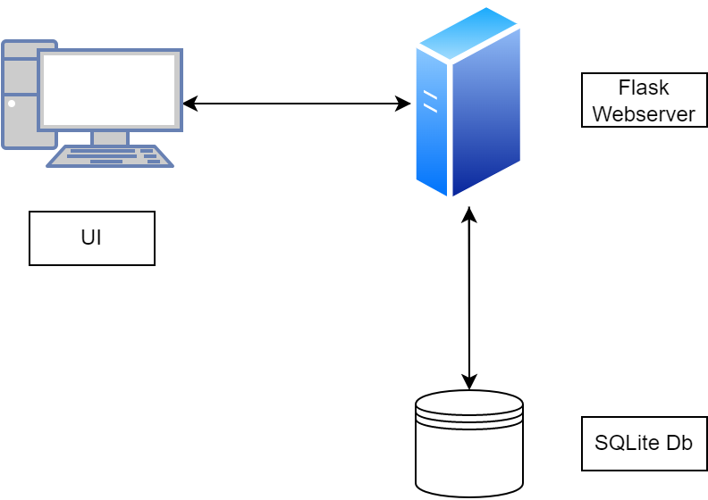

**Gym Workout Tracker**

Im Rahmen des Moduls PROG2 hatten wir Studenten den Auftrag, eine Webapp zu erstellen, welche Daten speichern, verarbeiten und wiedergeben kann.

Die erstellte Webapp hilft dabei den Fortschritt im Gym zo protokollieren und überwachen. Damit kann die Strategie des [Progressive Overload](https://www.healthline.com/health/progressive-overload) einfacher umgesetzt werden. 

Über ein Webformular können Sportler (Nutzer) ihre ausgeführten Übungen erfassen, welche in Folge in einer Datenbank gespeichert werden. Die erfassten Sets werden in einer durchsuchbaren Tabelle dargestellt. Ausserdem bietet die Tabelle die Funktion, die Übungen nach einer der Kategorien zu ordnen.

Über der Tabelle können die besten Übungen pro Kategorie abgefragt werden. Dabei kann entweder die Übung mit dem höchstem Gewicht, der höchsten Anzahl an Wiederholungen oder dem höchstem Volumen (Gewicht*Wiederholungen) abgefragt werden. Sollten zwei Übungen in der abgefragten Kategorie identisch sein, wird jeweils die Übung mit dem aktuellsten Datum angezeigt.

**Eingesetze Technologien**

[Flask](https://palletsprojects.com/p/flask/) als Web Framework

[Jinja 2](https://palletsprojects.com/p/jinja/) als Template Engine

[Datatables](https://datatables.net/) für die Tabelle

[SQLite](https://www.sqlite.org/index.html) mit [sqlite3](https://docs.python.org/3/library/sqlite3.html) Python Module zur Persisiterung der Daten

**Architektur Diagramm**

